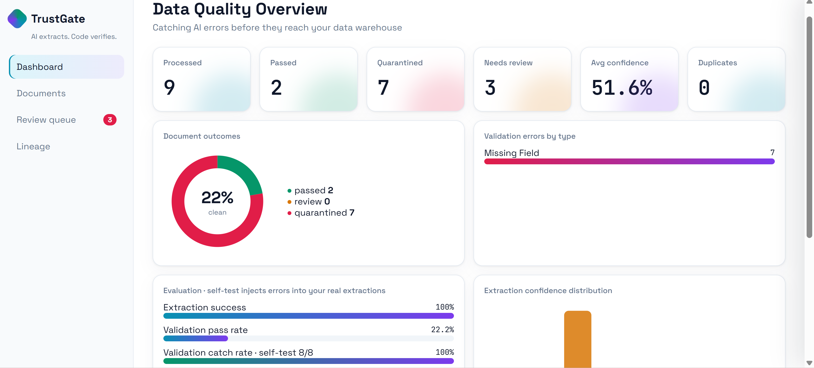
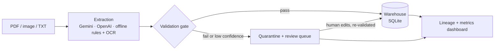

# TrustGate: AI extracts. Code verifies.

   

A document-to-warehouse ETL pipeline that never trusts raw LLM output. Every invoice, receipt or lab report is extracted, checked by deterministic code, and only then loaded. Anything doubtful is quarantined and fixed by a human reviewer, and the system measures how well its own quality gate works.



## Why this exists
LLMs and OCR make mistakes: wrong totals, missing fields, misread dates. Loaded straight into a warehouse, those errors silently corrupt every report built on top. TrustGate puts a quality gate between extraction and storage.

> **Example:** an invoice shows Subtotal 400.00 + VAT 40.00, but the printed total is 450.00. The gate flags `Total Mismatch`, quarantines the document, and a reviewer corrects it to 440.00. The corrected record is validated again before it reaches the warehouse.

## Highlights
- **Multi-format ingestion:** PDF, JPG, PNG and TXT, by drag-and-drop or by dropping files into a watched folder.
- **Pluggable extraction:** Gemini or OpenAI when a key is set, otherwise an offline parser (pdfplumber + rules, Tesseract OCR for images). If an API call fails, for example on quota, it falls back to the offline parser instead of crashing.
- **Deterministic quality gate:** missing fields, invalid dates and currencies, total reconciliation, duplicate detection.
- **Human-in-the-loop:** reviewers edit values in the UI, and the same gate runs again before loading.
- **Per-document lineage:** file hash, model, model, prompt and pipeline versions, confidence, processing time, decision.
- **Honest evaluation:** metrics come from your own documents, and anything unmeasurable shows "not measured".

## Architecture


## Validation checks
| Check | Rule |
|---|---|
| Missing field | id, party, date (plus currency and total for invoices) must be present |
| Invalid date | must be a real calendar date |
| Invalid currency | must be one of USD, EUR, GBP, BDT |
| Total mismatch | subtotal + tax = total, and the sum of line items = subtotal when items exist |
| Duplicate | SHA-256 file hash already seen |
| Extraction failed | nothing usable could be read |

Confidence is **computed by the pipeline** from field completeness and whether the math reconciles. It is never taken from the model's own claim.

## Metrics
- **Extraction success** and **validation pass rate**
- **Validation catch rate (self-test):** errors are injected into clean extractions and the validator must flag them
- **Field accuracy vs reviewer corrections:** model output compared with what a human finally approved
- Optional: `inject_real.py` injects errors and duplicates into real files, and labels can be added in `data/ground_truth_real.json`

### Results on my test set
| Metric | Result |
|---|---|
| Documents processed | 9 |
| Extraction success | 100% |
| Validation catch rate (self-test) | 100% |
| Field accuracy vs reviewer corrections | 0 reviews completed |
| Sent to human review | 77.8% |

*Test data: [e.g. 40 Northwind invoice PDFs and 5 hand-made lab reports]. Generate this table with `python evals/report.py`.*

## Quick start
```bash
git clone https://github.com/NamTas/trustgate-etl.git
cd trustgate-etl
pip install pdfplumber
cp .env.example .env        # Windows: copy .env.example .env
# add GEMINI_API_KEY (optional, offline mode works without it)
python check_setup.py       # diagnoses key, model and libraries
python server.py            # open http://localhost:8000
```
Add documents on the dashboard or copy them into `data/real_documents/`. Tests: `python -m pytest tests`.

## Project structure
```
server.py            HTTP API, dashboard and folder watcher
src/extract.py       Gemini / OpenAI / offline extraction, throttling, retry, fallback
src/validate.py      deterministic quality gate
src/pipeline.py      orchestration, warehouse load, human review
src/evals.py         metrics and validation self-test
src/inject.py        error injection used by evals
static/index.html    single-file dashboard (dark and light)
evals/report.py      results table for this README
inject_real.py       inject errors and duplicates into real files
check_setup.py       setup diagnostics
tests/               unit tests for the validator
tools/               optional synthetic benchmark (separate database)
```
**Storage**: SQLite with a `documents` table (lineage and status) and a `warehouse_records` table (validated data only).

## Design decisions
- **Validation is code, not a prompt.** The model proposes, the gate decides.
- **Humans are subject to the gate too.** A reviewer cannot load an invalid record.
- **Graceful degradation:** per-minute rate limits wait and retry, and daily quota falls back to the offline parser.
- **No fake numbers:** unmeasured metrics are shown as "not measured".
- **Light footprint:** standard-library server and SQLite, with `pdfplumber` for PDFs.

## Limitations
- The offline parser works best on text-based PDFs with labelled lines (`Subtotal`, `Tax`, `Total`). Scanned files need Gemini/OpenAI or Tesseract.
- The math check covers subtotal + tax = total. Discounts and shipping lines are not modelled yet.
- The currency list is limited to four codes.
- [Write honestly which parts you tested with a live Gemini key and which you did not.]

## Roadmap
PostgreSQL warehouse, configurable currency and tax rules, discount and shipping support, per-vendor templates, Docker image.

## Data
Public sample invoices from the Northwind invoices dataset (Hugging Face, `AyoubChLin/northwind_invocies`, apache-2.0). No personal documents are included in this repository.

## Author
**Namira Tasnim** · [GitHub](https://github.com/NamTas) · [LinkedIn](https://www.linkedin.com/in/namtas)
